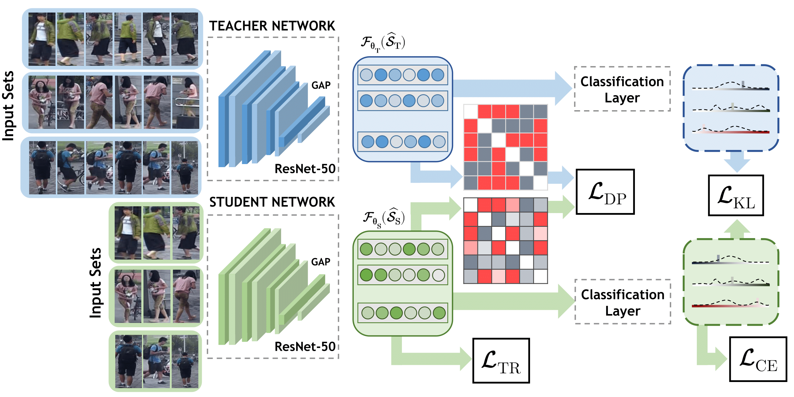

# Robust Re-Identification by Multiple Views Knowledge Distillation

This repository contains Pytorch code for the [ECCV20](https://eccv2020.eu/) paper "Robust Re-Identification by Multiple Views Knowledge Distillation" [[arXiv](http://arxiv.org/abs/2007.04174)]



```bibtex
@inproceedings{porrello2020robust,
author={Porrello, Angelo and Bergamini, Luca and Calderara, Simone},
title = {Robust Re-Identification by Multiple Views Knowledge Distillation},
booktitle = {The European Conference on Computer Vision (ECCV)},
year = {2020}
}
```

## Installation Note

Tested with Python3.6.8 on Ubuntu (17.04, 18.04).

- Setup an empty pip environment 
- Install packages using ``pip install -r requirements.txt``
- Install torch1.3.1 using ``pip install torch==1.3.1+cu92 torchvision==0.4.2+cu92 -f https://download.pytorch.org/whl/torch_stable.html
``
- Place datasets in ``.datasets/`` (Please note you may need do request some of them to their respective authors)
- Run scripts from ```commands.txt```

Please note that if you're running the code from Pycharm (or another IDE) you may need to manually set the working path to ``PROJECT_PATH``

## VKD Training (MARS [1])

### Data preparation
- Create the folder ``./datasets/mars``
- Download the dataset from [here](https://drive.google.com/drive/u/1/folders/0B6tjyrV1YrHeMVV2UFFXQld6X1E)
- Unzip data and place the two folders inside the MARS [1] folder
- Download metadata from [here](https://github.com/liangzheng06/MARS-evaluation/tree/master/info)
- Place them in a folder named ``info`` under the same path
- You should end up with the following structure:

```
PROJECT_PATH/datasets/mars/
|-- bbox_train/
|-- bbox_test/
|-- info/
```

### Teacher-student training

```shell
# To train ResNet-50 on MARS (teacher, first step) run:
python ./tools/train_v2v.py mars --backbone resnet50 --num_train_images 8 --p 8 --k 4 --exp_name base_mars_resnet50 --first_milestone 100 --step_milestone 100

# To train a ResVKD-50 (student) run:
python ./tools/train_distill.py mars ./logs/base_mars_resnet50 --exp_name distill_mars_resnet50 --p 12 --k 4 --step_milestone 150 --num_epochs 500
```

## Model Zoo

You can download from [here](https://drive.google.com/drive/folders/1EiiV4Q02dP9ASE7-zvlZdIDin3Xf6qp2?usp=sharing) a bunch of pre-trained checkpoints (``baseline.zip`` contains weights of the teacher networks, ``distilled.zip`` the student ones). To evaluate ResNet-50 and ResVKD-50 on MARS, proceed as follows:
- Download ``baseline.zip`` and ``distilled.zip`` (~4.8 GB)
- Unzip the two folders inside the ``PROJECT_PATH/logs`` folder
- Then, you can evaluate both networks using the ``eval.py`` script:

```sh
python ./tools/eval.py mars ./logs/baseline_public/mars/base_mars_resnet50 --trinet_chk_name chk_end
```

```sh
python ./tools/eval.py mars ./logs/distilled_public/mars/selfdistill/distill_mars_resnet50 --trinet_chk_name chk_di_1
```

You should end up with the following results on MARS (see Tab.1 of the paper for VeRi-776 and Duke-Video-ReID):

Backbone|top1 I2V|mAP I2V|top1 V2V|mAP V2V
:-:|:-:|:-:|:-:|:-:
``ResNet-34`` | 80.81 | 70.74 | 86.67 | 78.03 
``ResVKD-34`` | **82.17** | **73.68** | **87.83** | **79.50**
``ResNet-50`` | 82.22 | 73.38 | 87.88 | 81.13 
``ResVKD-50`` | **83.89** | **77.27** | **88.74** | **82.22** 
``ResNet-101`` | 82.78 | 74.94 | 88.59 | 81.66 
``ResVKD-101`` | **85.91** | **77.64** | **89.60** | **82.65** 

Backbone|top1 I2V|mAP I2V|top1 V2V|mAP V2V
:-:|:-:|:-:|:-:|:-:
``ResNet-50bam`` | 82.58 | 74.11 | 88.54 | 81.19 
``ResVKD-50bam`` | **84.34** | **78.13** | **89.39** | **83.07** 

Backbone|top1 I2V|mAP I2V|top1 V2V|mAP V2V
:-:|:-:|:-:|:-:|:-:
``DenseNet-121`` | 82.68 | 74.34 | 89.75 | 81.93 
``DenseVKD-121`` | **84.04** | **77.09** | **89.80** | **82.84** 

Backbone|top1 I2V|mAP I2V|top1 V2V|mAP V2V
:-:|:-:|:-:|:-:|:-:
``MobileNet-V2`` | 78.64 | 67.94 | 85.96 | 77.10 
``MobileVKD-V2`` | **83.33** | **73.95** | **88.13** | **79.62**

## References

1. Zheng, L., Bie, Z., Sun, Y., Wang, J., Su, C., Wang, S., Tian, Q.: Mars: A video benchmark for large-scale person re-identification. In: European Conference on Computer Vision (2016)

